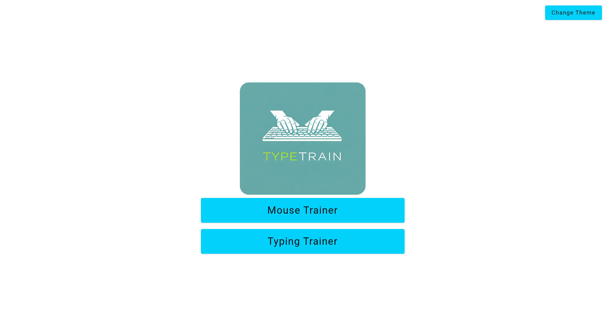
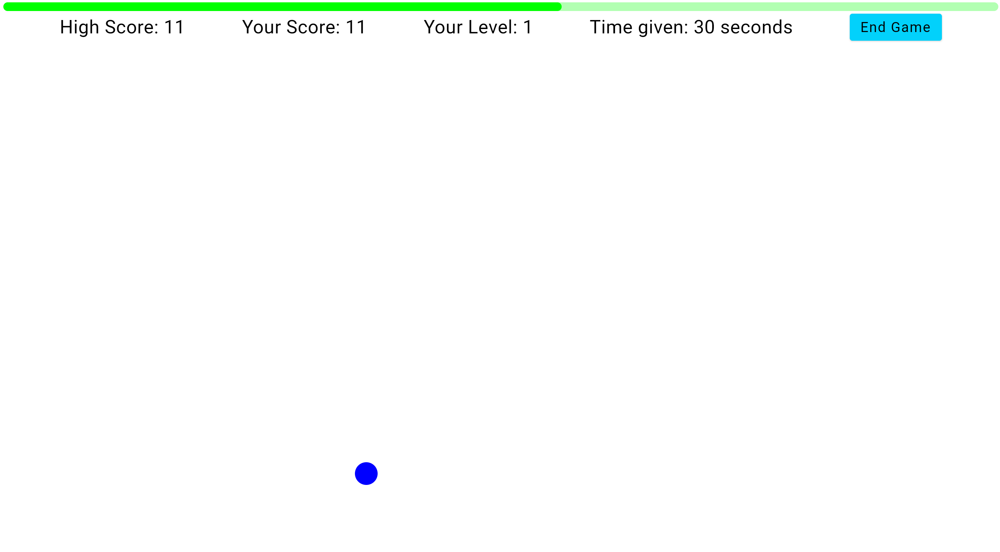
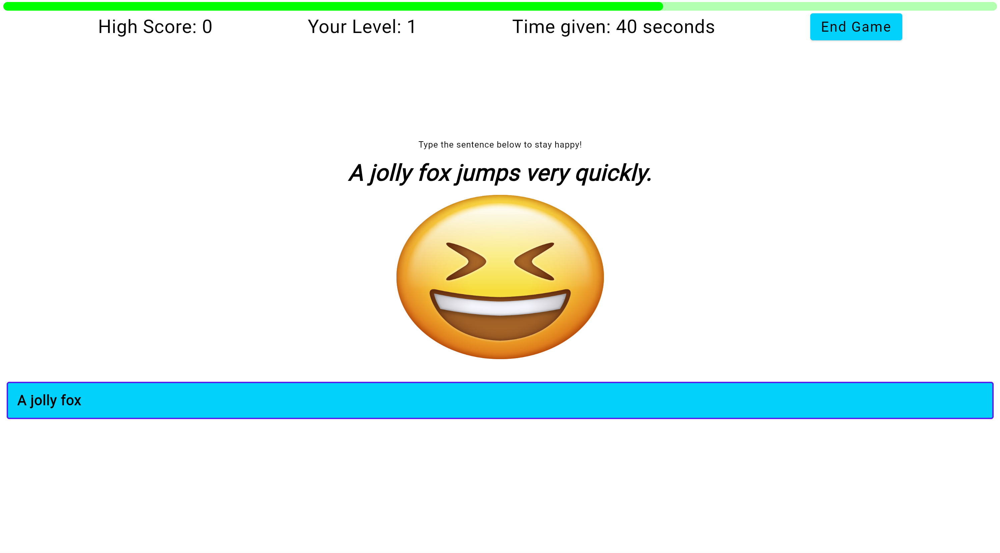

# TypeTrain - Interactive Typing and Mouse Accuracy Trainer

TypeTrain is a modern, interactive web application built with Kotlin/WASM and Jetpack Compose for Web that helps users improve their typing speed and mouse accuracy through engaging training exercises.

## 🎯 Features

### 🖱️ Mouse Accuracy Trainer

- Progressive difficulty levels
- Dynamic target tracking with real-time score feedback
- Visual performance indicators through color-coded progress bars
- Penalty system for misclicks to encourage precision
- High score tracking to measure improvement
- Adaptive difficulty: Time reduces by 5 seconds as you advance through levels

### ⌨️ Keyboard Typing Trainer

- Collection of carefully crafted sentences for typing practice
- Progressive difficulty with increasingly complex sentences
- Real-time accuracy and speed tracking
- Timer-based challenges to improve typing under pressure
- High score system to track personal bests

## 🎯 Who Is It For?

- Students looking to improve their typing efficiency for academic work
- Professionals who want to enhance their productivity through better typing speed
- Gamers seeking to improve their mouse accuracy and reaction time
- Anyone interested in developing better computer interaction skills
- Educational institutions teaching computer literacy
- Office workers wanting to reduce typing-related fatigue through better technique

## 🚀 Benefits

- Improve typing speed and accuracy in an engaging way
- Enhance mouse precision for better productivity
- Track progress through detailed metrics
- Practice in a stress-free, gamified environment
- Develop muscle memory through regular practice
- Reduce errors in daily computer usage

## 💻 Technical Details

- Built with Kotlin Multiplatform (KMP) targeting WebAssembly
- Uses Jetpack Compose for the user interface
- Theme customization support
- Smooth animations and transitions
- No backend required - runs entirely in the browser

## 🎨 Features

- Clean, modern user interface
- Multiple theme options
- Real-time performance metrics
- Progressive difficulty system
- High score tracking
- Responsive design
- Smooth animations

## 🛠️ Getting Started

1. Visit the TypeTrain website
2. Choose between Mouse Trainer or Typing Trainer
3. Track your improvement through the high score system

## 💡 Tips for Best Results

- Practice regularly for consistent improvement
- Pay attention to accuracy before focusing on speed
- Take breaks to prevent fatigue
- Use the high score system to set personal goals

## 🤝 Contributing

Contributions are welcome! Feel free to submit issues and pull requests.

## 📝 License

This project is licensed under the GPL3 License - see the LICENSE file for details.

---

Made with ❤️ using Kotlin/WASM and Jetpack Compose
